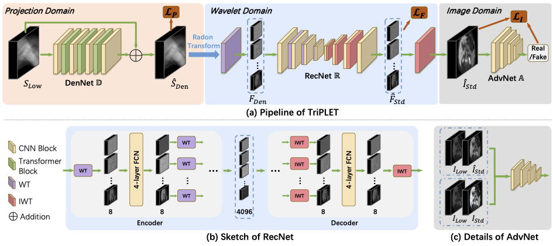

# End-to-end Triple-domain PET Enhancement: A Hybrid Denoising-and-reconstruction Framework for Reconstructing Standard-dose PET Images from Low-dose PET Sinograms
This repo contains the supported pytorch code and configuration files of our work

## Overview of our TriPLET

# Implementation
Train the model using train.py. Use test.py to test the trained model.

# Acknowledgement
This code is heavily build on the following repositories:

(1) https://github.com/lpj-github-io/MWCNNv2

(2) https://github.com/lpj0/MWCNN_PyTorch

(3) https://github.com/microsoft/Swin-Transformer